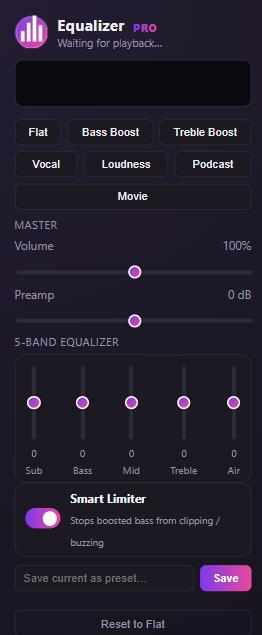

# YouTube Equalizer Pro

Chrome extension that adds a 5-band audio equalizer, volume/preamp control, presets and a live spectrum visualizer to YouTube — all via the Web Audio API, no server or account needed.



## Features

- **5-band EQ** — Sub, Bass, Mid, Treble, Air (each ±15 dB)
- **Preamp + Volume** — master gain control (0–200%)
- **Smart Limiter** — a dynamics compressor that catches peaks from boosted bass so it compresses instead of clipping/buzzing
- **Presets** — Flat, Bass Boost, Treble Boost, Vocal, Loudness, Podcast, Movie
- **Custom presets** — save your own EQ settings by name, delete anytime
- **Live spectrum visualizer** — real-time frequency bars in the popup
- **Settings persist** per-browser via `chrome.storage.local` and apply automatically to every YouTube tab

## Install (unpacked, from source)

1. Clone or download this repo.
2. Open Chrome and go to `chrome://extensions`.
3. Turn on **Developer mode** (top-right toggle).
4. Click **Load unpacked** and select this project's folder.
5. Open any YouTube video and click the extension icon to open the equalizer.

## Usage

- Play a YouTube video, click the toolbar icon.
- Drag the band sliders or pick a preset — changes apply live.
- Toggle **Smart Limiter** off only if you want the raw, unlimited signal.
- Type a name and hit **Save** to store your current settings as a custom preset.

## How it works

The content script (`content.js`) taps the page's `<video>` element into a Web Audio graph:

```
source -> preamp -> sub(lowshelf) -> bass(peaking) -> mid(peaking)
       -> treble(peaking) -> air(highshelf) -> compressor(limiter)
       -> volume -> analyser -> destination
```

The popup (`popup.html` / `popup.js`) reads and writes settings to `chrome.storage.local`; the content script listens for changes and applies them with smoothed parameter ramps (no zipper/click noise on slider drag). The popup also polls the content script for live frequency data to draw the spectrum bars.

## Permissions

- `storage` — save your EQ settings and presets
- `activeTab` — read which YouTube tab is active, for the spectrum visualizer
- Host access limited to `*.youtube.com`

## Notes

- The equalizer only affects YouTube tab audio, not system-wide audio.
- Autoplay policies may keep the audio context suspended until you interact with the page or press play; the extension resumes it automatically on playback.
